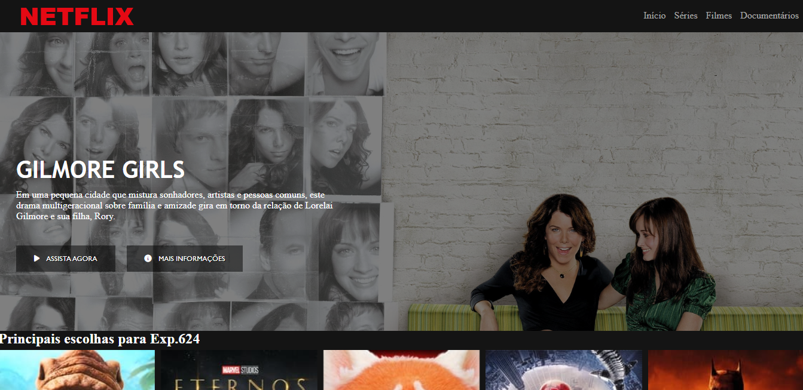

## Desafio de Projeto DIO: recriando a interface do Netflix 🚀
Criação de interface com base no streaming Netflix, utilizando HTML, CSS e JavaScript.  
Desafio de Projeto concluído para o Bootcamp Carrefour Web Developer, realizado pela [DIO](https://www.dio.me/).

Visite [meu perfil](https://www.linkedin.com/in/luisafolharini/) 😃
